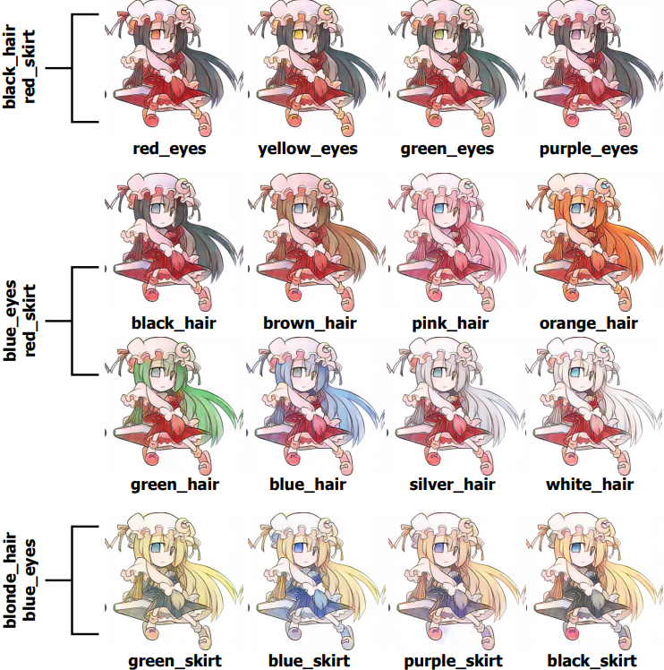

# Tag2Pix: Line Art Colorization Using Text Tag With SECat and Changing Loss 



[ICCV 2019]
This repository is the official PyTorch implementation of [Tag2Pix](http://arxiv.org/abs/1908.05840).

> **Tag2Pix: Line Art Colorization Using Text Tag With SECat and Changing Loss**<br>
> Hyunsu Kim∗, Ho Young Jhoo∗, Eunhyeok Park, and Sungjoo Yoo (\* equal contribution)<br> 
> Seoul National University
> 
> **Abstract:** *Line art colorization is expensive and challenging to automate. A GAN approach is proposed, called Tag2Pix, of line art colorization which takes as input a grayscale line art and color tag information and produces a quality colored image. First, we present the Tag2Pix line art colorization dataset. A generator network is proposed which consists of convolutional layers to transform the input line art, a pre-trained semantic extraction network, and an encoder for input color information. The discriminator is based on an auxiliary classifier GAN to classify the tag information as well as genuineness. In addition, we propose a novel network structure called SECat, which makes the generator properly colorize even small features such as eyes, and also suggest a novel two-step training method where the generator and discriminator first learn the notion of object and shape and then, based on the learned notion, learn colorization, such as where and how to place which color. We present both quantitative and qualitative evaluations which prove the effectiveness of the proposed method.*


## Prerequisite
 * pytorch >= 1.0.1
 * torchvision >= 0.2.2
 * numpy
 * scipy 
 * python-opencv
 * scikit-image
 * Pillow (PIL)
 * imageio
 * tqdm
 * tensorflow / keras (for dataset making) 

## Test

Download all network dumps from [releases](https://github.com/blandocs/tag2pix/releases) and place it in this project root directory.

 * 512px: `python main.py --test --thread=1 --batch=1 --data_dir=testset --load=tag2pix_512.pkl --input_size=512 --no_bn`
 * 256px: `python main.py --test --thread=1 --batch=1 --data_dir=testset --load=tag2pix_256.pkl`

Saved images will be placed in `results/tag2pix_512` or `results/tag2pix_256`. Please change thread or batch counts based on your machine specifications.

or use [tag2pix-gui](https://github.com/MerHS/tag2pix-gui)


## Training with custom / updated dataset

We used 39031 rgb images and 16224 cropped face images in the Danbooru2017 Dataset to train the network. Lots of images are filtered out because of inappropriate tags and resolution. 

If you need more train images, check Danbooru2018 and make larger dataset manually by following the procedure below.

### Making Train Dataset

This whole process was tested in Windows 10. If you use the other OS, you might use alternative implementation of  waifu2x-caffe.

#### TL;DR

1. `sh download_dataset.sh` 

Run this script from your terminal or Windows Subsystem Linux.
If this script fails, download the dataset manually from [Danbooru2018](https://www.gwern.net/Danbooru2018) official webpage.

2. 

``` 
python preprocessor/tagset_extractor.py
python preprocessor/crop_and_upscale.py
python preprocessor/sketch_extractor.py
python preprocessor/face_extractor.py
```

After all, remove images in `dataset/temp_faces`  that are not face images

Then, `python preprocessor/face_extractor.py --add_all`

3. `python main.py --epoch=25 --batch_size=4 --input_size=512 --cit_cvt_weight 40 40 --two_step_epoch=5 --brightness_epoch=21 --save_all_epoch=21 --no_bn` 

(512px single GPU)


#### Detailed Manual

1. **Download [Danbooru2018](https://www.gwern.net/Danbooru2018) SFW 512x512px dataset & metadata**

```
rsync --progress --verbose rsync://78.46.86.149:873/danbooru2018/metadata.json.tar.xz ./dataset/
mkdir ./dataset/metadata
tar -xf ./dataset/metadata.json.tar.xz -C ./dataset
rm dataset/metadata.json.tar.xz

rsync --recursive --times --verbose rsync://78.46.86.149:873/danbooru2018/512px/ ./dataset/512px/
```

Downloading time may take a couple of days depending on your network condition. You don't need to download every images in the Danbooru2018 dataset, so you are free to manually pause the running process.

Metadata file of Danbooru2017 and 2018 contains lists of JSON objects like below. (omitted unrelated keys)

```jsonc
{
    "id":"263167",
    "rating":"s",
    "image_width":"551",
    "image_height":"778",
    "file_ext":"jpg",
    "file_size":"52253",
    "tags": [
        {"id":"470575","name":"1girl","category":"0"},
        {"id":"572410","name":"ankle_ribbon","category":"0"},
        {"id":"437490","name":"artist_request","category":"5"},
        {"id":"16751","name":"bangs","category":"0"},
        {"id":"11826","name":"barefoot","category":"0"},
        {"id":"537684","name":"blunt_bangs","category":"0"},
        {"id":"16867","name":"brown_hair","category":"0"},
        {"id":"2817","name":"eyes","category":"0"},
        {"id":"454933","name":"hair_bun","category":"0"},
        {"id":"446622","name":"hime_cut","category":"0"},
        {"id":"1707","name":"japanese_clothes","category":"0"},
        {"id":"13197","name":"long_hair","category":"0"},
        {"id":"1287928","name":"miyu_(vampire_princess_miyu)","category":"4"},
        {"id":"464575","name":"ribbon","category":"0"},
        {"id":"212816","name":"solo","category":"0"},
        {"id":"15189","name":"vampire_princess_miyu","category":"3"},
        {"id":"89189","name":"yellow_eyes","category":"0"}],
}
```

In this JSON object, We should collect `id, image_width, image_height, tags (category 0)`.


2. **Parse metadata files and filter out the images with unrelated tags**

> `python preprocessor/tagset_extractor.py`

This script will make `dataset/tags.txt`, `dataset/resolutions.pkl` and `dataset/train_image_base`. 

`tags.txt` consists extracted tags and file_ids based on metadata json file. For example, the above JSON object will be changed to this one line and written down to `tags.txt`.

> `263167 470575 572410 16751 11826 537684 16867 2817 454933 446622 1707 13197 464575 212816 89189`

Train images are selected based on whitelist tagsets, (single person, simple background, single eye color and hair color) and blacklist tagsets. (real pictures, sketches/monochrome, manga, etc.) 

And also we filtered small or narrow images based on the resolution of image. (between 3:4 to 4:3, longer side is bigger than 512px)

Finally, selected images in the `dataset/512px` will be moved to `dataset/train_image_base`.

These processes will be conducted upon `tagset_extractor.py`, but this script may not filter all the inappropriate images. So you should check and remove unsound images from `dataset/train_image_base` manually. Removed images will not be used in the training process.

At the same time, resolutions of collected images are in `dataset/resolutions.pkl`. This file will be used on the next step.

The original tagset that we used in the paper is in [tags.txt](tags.txt). 

3. **Crop letterboxes & Upscale with waifu2x**

> `python preprocessor/crop_and_upscale.py`

The 512px image set of Danbooru2018 have black letterboxes. This script removes the letterboxes and generates rectangular images by mirror padding. (Images with white borders will be filled with white padding) The resolution of original images will be obtained from metadata file to remove letterboxes, so you should not remove metadata files. 

Next, upscaling of the images to 768px upon waifu2x is done through following steps. If you use Windows, the OS automatically downloads waifu2x-caffe, but the other OS does not, and it upscale images with LANCZOS filter. If you want clearer images, you can use other Linux compatible waifu2x implementation. 

If you want to upscale images by yourself, `python preprocessor/crop_and_upscale.py --crop_only` only allow removing of letterboxes.

Cropped images and upscaled images will be placed in `dataset/rgb_cropped`, `dataset/rgb_train` respectively.

Every lineart in `dataset/liner_test` will be replaced by the cropped images.

4. **Extract line arts**

> `python preprocessor/sketch_extractor.py`

To train tag2pix, we need five directories and a text file with tag infos.

 * `dataset/rgb_train`
 * `dataset/keras_train` : Extracted with [sketchKeras](https://github.com/lllyasviel/sketchKeras)
 * `dataset/xdog_train` : Extracted with XDoG 
 * `dataset/simpl_train` : Extracted with [Sketch Simplification](https://github.com/bobbens/sketch_simplification).
 * `dataset/benchmark` : Test images (colorize images in this directory by every training epoch.)
 * `dataset/keras_test` : Test sketches corresponding to `dataset/benchmark`
 * `datasets/tags.txt`

Due to the LICENSE of [Sketch Simplification](https://github.com/bobbens/sketch_simplification), we cannot afford any codes related to simplifying sketches. If you need it, you should make simplified sketches by yourself. If you don't, simply remove `simpl_train` directory in the dataset.

If you want to use Sketch Simplification, we highly recommend using upscaled images larger than 768px. By default, `sketch_extractor.py` tries to upscale images in `keras_train`, so if you do not want it, add `--no_upscale` option before you run this script.


5. **Crop faces by [lbpcascade_animeface](https://github.com/nagadomi/lbpcascade_animeface) & add tag lines of facial images to `tags.txt`**

> `python preprocessor/face_extractor.py`

[lbpcascade_animeface](https://github.com/nagadomi/lbpcascade_animeface) extracts face positions in an anime style image, but it makes a lot of mistakes. 

This script (`face_extractor.py`) extracts facial images from `dataset/rgb_train` and saves images and face positions to `dataset/temp_faces`. After running it, you should remove improper images from `temp_faces` directory. 

Then, run this line to add face images to your train dataset. It also appends some tag lines to the `tags.txt`. (extracts eye/hair tags only)

> `python preprocessor/face_extractor.py --add_all`

It only extracts faces larger than 128x128px. Because of this restriction, we recommend upscaling original images with waifu2x.


6. (Optional) Select test images and place it to `dataset/benchmark`

Test images should be RGB images, and also corresponding line arts have to be in `dataset/keras_test`. 

Test images are randomly selected in the third step, but if you want to use custom test image, place rgb and line art in the mentioned directory, and update `dataset/tags.txt`

After step 3. `dataset/liner_test` will be created and contain (mainly) monochrome arts. (Images are filtered by `monochrome, grayscale, sketch` tags, but it does not guarantee that all images are real line arts) Copy and paste some to both `dataset/benchmark` and `dataset/keras_test` directories, and append CVT lines to `dataset/tags.txt` then you can get colorized images while you are training your network.

CAUTION: The name of every train image should be able to parsed to integer.


#### CIT / CVT Tag List

`loader/tag_dump.pkl` contains tag indices that we use.
```jsonc
{
    "iv_tag_list": [429, 1882, ...], // CIT tag list (total 370, not sorted)
    "cv_tag_list": [613194, 613209, ...], // CVT tag list (total 115, not sorted)
    "tag_dict": {
        "1girl": 470575,
        "solo": 212816,
        ...
    } // tag dictionary
}
```


## Notable arguments

 * `--epoch` : Total training epoch
 * `--input_size`: Width/height pixel sizes of input images
 * `--batch_size` : Total batch size (TITAN Xp -> 256px: 14 images per GPU / 512px: 4 images per GPU (without BN))
 * `--data_size`: Numbers of training images per 1 epoch
 * `--cit_cvt_weight`: CIT/CVT discrimination weight. 
 * `--two_step_epoch`: If nonzero, set --cit_cvt_weight [0, 0] before --two_step_epoch, then revert --cit_cvt_weight that is applied by user.
 * `--brightness_epoch`: If nonzero, apply brightness control after this epoch (see the paper)
 * `--save_all_epoch`: If nonzero, save weights by every epoch after this epoch.
 * `--no_bn`: Remove BN in all layers (It can reduce GPU consumption in 512px training, and it's also usable in a training with small batch sizes per GPU)
 * `--seed`: Random seed (PyTorch does not guarantee reproducibility. We tried to fix every random seeds and undeterministic behaviours, but we also do not guarantee this can reproduce the weights.)

Example: (for 8 TITAN Xp GPU)
 - `python main.py --epoch=30 --input_size=512 --batch_size=32 --cit_cvt_weight 40 40 --two_step_epoch=5 --brightness_epoch=24 --save_all_epoch=24 --no_bn`
 - `python main.py --epoch=60 --input_size=256 --batch_size=112 --cit_cvt_weight 40 40 --two_step_epoch=10 --save_all_epoch=40` 

The code is heavliy refactored after the submission, the exact preprocessing and training setting are might not be as same as above.

## LICENSE

Training / Testing codes are distributed under MIT License.

Every learned weight, network dump in the release channel (`model.pth, tag2pix_512.pkl`) is available for non-commercial purpose. Any redistribution is explicitly restricted.
